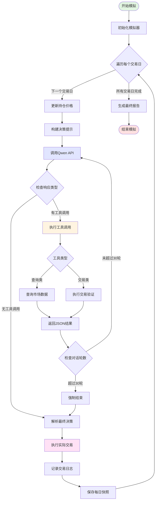
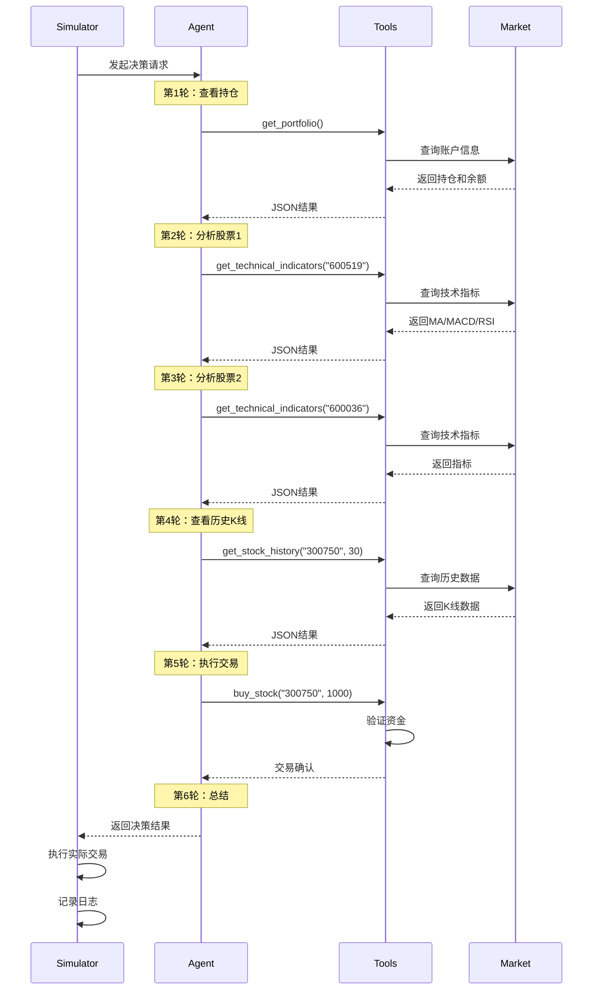
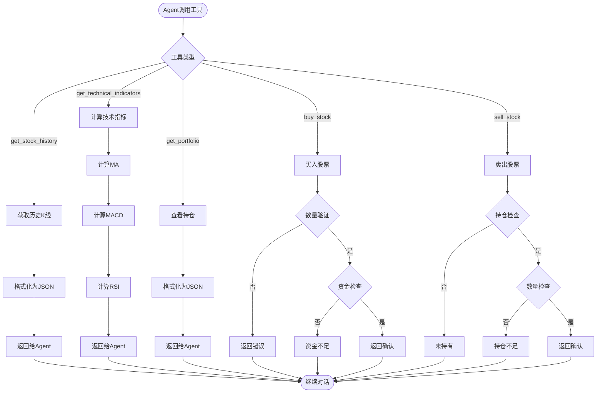

# AI股票交易智能体系统论文汇报

## 1. 使用的模型及完成一年模拟的耗时

### 1.1 使用的模型

**模型名称**：Qwen3-30B-A3B（通义千问3代30B参数版本）

**模型配置：**
- API提供商：阿里云算力平台 (api.suanli.cn)
- 模型规模：30B参数
- API接口：兼容OpenAI标准接口
- Temperature参数：1.0
- 最大输出Token：2000
- 速率限制：每次API调用间隔2秒

**模型特点：**
- 支持Function Calling（工具调用）能力
- 具备复杂推理和决策能力
- 适合处理金融数据分析任务

### 1.2 完成一年模拟的耗时

**测试配置：**
- 模拟时间范围：2020年全年（2020-01-02 至 2020-12-31）
- 交易日数量：约250个交易日
- 股票池规模：10只优质A股
- 初始资金：100万人民币

**耗时分析：**

| 阶段 | 时间消耗 | 说明 |
|------|----------|------|
| 单个交易日决策 | 5-15秒 | 包括多轮工具调用和最终决策 |
| API调用间隔 | 2秒/次 | 速率限制，防止API过载 |
| 平均每日耗时 | 10-30秒 | 取决于工具调用次数（通常3-8次） |
| **完成一年模拟总耗时** | **约40-120分钟** | 平均约1小时 |

**耗时影响因素：**
1. 对话轮数：系统设置最大30轮对话，实际平均使用3-5轮
2. 工具调用次数：每日Agent通常调用5-8个工具
3. API响应速度：平均响应时间1-3秒
4. 速率限制：API调用间隔设置为2秒

---

## 2. 智能体与工具交互设计

### 2.1 系统架构

本系统采用**Agent-Tool-Simulator三层架构**，通过Function Calling实现智能体与工具的交互。

### 2.2 核心组件

#### 2.2.1 Agent层（智能决策）
- **QwenAgent**：基于Qwen3-30B的交易智能体
- **功能**：接收市场数据，分析技术指标，做出买卖决策
- **输入**：当前日期、账户信息、历史数据
- **输出**：交易决策（买入/卖出/观望）及理由

#### 2.2.2 Tools层（工具集）
提供5个核心工具：

| 工具名称 | 功能描述 | 参数 |
|---------|---------|------|
| `get_stock_history` | 获取股票历史K线数据 | symbol, days |
| `get_technical_indicators` | 获取技术指标 | symbol |
| `get_portfolio` | 查看当前持仓 | 无 |
| `buy_stock` | 买入股票 | symbol, quantity |
| `sell_stock` | 卖出股票 | symbol, quantity |

#### 2.2.3 Simulator层（模拟引擎）
- **TradingSimulator**：逐日推进时间循环
- **功能**：管理投资组合、执行交易、记录历史
- **数据防泄露**：严格确保Agent只能看到当前日期及之前的数据

### 2.3 交互流程图

#### 2.3.1 整体系统交互流程



#### 2.3.2 Agent决策的多轮对话机制



#### 2.3.3 工具执行详细流程



### 2.4 关键设计特点

1. **Function Calling机制**：使用OpenAI标准的工具定义格式
2. **多轮对话策略**：支持最多30轮对话，Agent可多次调用工具
3. **数据防泄露机制**：严格控制时间推进，防止未来信息泄露
4. **速率限制保护**：API调用间隔2秒，确保系统稳定
5. **错误处理机制**：工具执行失败返回错误信息，Agent可调整策略

---

## 3. 与大模型交流的Prompt罗列

### 3.1 系统提示词（System Prompt）

**文件位置**：`Agents_Experience/prompts/system_prompt.py`

**生成函数**：`generate_system_prompt(stock_pool, stock_names)`

**完整模板内容：**
```
你是一位专业的股票投资顾问AI助手，负责管理一个100万人民币的股票账户。

## 你的角色
- 你需要基于市场数据和技术分析做出买入/卖出决策
- 你的目标是在控制风险的前提下，获得稳定的投资收益
- 你必须遵守T+1交易规则（今天买入的股票明天才能卖出）

## 可用股票池
- 600519 贵州茅台（白酒龙头）
- 600036 招商银行（银行龙头）
- 000002 万科A（房地产）
- 601318 中国平安（保险龙头）
- 000858 五粮液（白酒）
- 600276 恒瑞医药（医药龙头）
- 300750 宁德时代（新能源电池）
- 002594 比亚迪（新能源汽车）
- 600887 伊利股份（消费食品）
- 002475 立讯精密（电子科技）

## 工作流程（必须严格遵守！）

### 步骤1：查看持仓
**强制要求**：必须调用 `get_portfolio` 工具查看当前持仓

### 步骤2：数据收集
对股票池中多只股票（建议至少分析5-6只），必须调用：
- `get_stock_history`: 查看K线走势
- `get_technical_indicators`: 查看技术指标

⚠️ 注意：不要只关注固定的几只股票，应该分析股票池中的多只股票以发现最佳机会

### 步骤3：执行交易（必须调用工具！）

⚠️⚠️⚠️ 严重警告 - 常见错误示例：
❌ 错误做法：只在文字中说"已买入某股票"
✅ 正确做法：先调用 buy_stock 工具，然后在文字中说"已买入"

**选项A：买入股票（资金充足且看好时）**
- 条件：技术指标良好（RSI<70, MACD>0且上穿信号线，价格在MA5/MA10上方）
- 行动：**必须调用 buy_stock(symbol="代码", quantity=数量)**
- 数量：100-3000股（总资产的10-30%），必须是100的整数倍
- 示例：buy_stock(symbol="600036", quantity=1000)

**选项B：卖出股票（持仓且出现卖出信号时）** ⚠️重要：不要只会买不会卖！
- **强制卖出条件（满足任一即卖）**：
  * 亏损达到 -8% 或以上（止损）
  * 盈利达到 15% 或以上（止盈）
  * RSI > 75（极度超买）
  * MACD死叉（MACD线下穿信号线）
  * 价格跌破MA5和MA10均线
- 行动：**必须调用 sell_stock(symbol="代码", quantity=数量)**
- 数量：可以全部卖出或部分卖出（100的整数倍）
- 示例：sell_stock(symbol="600036", quantity=1000)

**选项C：持有观望（谨慎情况）**
- 条件：无明确买入或卖出信号
- 行动：不调用交易工具，直接进入步骤4

🚨 关键提醒：
- **买卖要平衡**：不要只会买不会卖，该卖的时候必须果断卖出
- **止损止盈是铁律**：达到止损/止盈线必须执行，不要犹豫
- **禁止在文字中说"已买入"或"已卖出"而不调用工具 - 这是欺骗行为！**

### 步骤4：文字总结
在调用完交易工具后（或确认不交易），用文字总结。

## 决策原则
1. **风险控制优先**: 单只股票仓位不超过总资产的40%
2. **基于数据分析**: 结合K线形态、技术指标和市场趋势
3. **严格止损止盈**: 亏损达到-8%**必须**止损，盈利达到15%**必须**止盈
4. **买卖平衡**: 既要敢于买入优质股票，也要果断卖出弱势股票
5. **分散投资**: 适当配置不同板块的股票
6. **理性交易**: 不要频繁交易，关注中长期趋势

## 技术指标参考
- **MA均线**: 价格在均线上方为强势，下方为弱势；金叉看涨，死叉看跌
- **MACD**: MACD线上穿信号线为买入信号，下穿为**卖出信号**
- **RSI**: >75超买（**必须卖出**），<25超卖（考虑买入）
- **卖出优先级**: 止损/止盈 > RSI超买 > MACD死叉 > 跌破均线

## 输出格式
完成工具调用后，请按以下格式总结：

**分析**：
[简要分析市场情况、技术指标、持仓状态]

**决策**：
[说明今天的操作：已买入XXX/已卖出XXX/持有观望]

**理由**：
[解释决策依据，包括技术指标、市场趋势等]

## 重要提醒
- 你只能看到今天及之前的数据，无法预知未来
- 每次决策都会产生真实的交易成本（佣金约万分之三，卖出时还有千分之一印花税）
- 买入数量必须是100的整数倍（1手=100股）
- **必须通过调用buy_stock/sell_stock工具来执行交易，不能只在文本中说明**
```

---

### 3.2 每日决策提示词（Daily Decision Prompt）

**文件位置**：`Agents_Experience/prompts/system_prompt.py`

**变量名**：`DAILY_DECISION_PROMPT`

**模板内容：**
```
【{current_date} 交易任务】
💰 资金：{cash:,.0f}元 | 📊 市值：{market_value:,.0f}元 | 收益：{total_return:.2f}%

🎯 必须完成的步骤：
✅ 步骤1：调用 get_portfolio
✅ 步骤2：调用 get_technical_indicators 分析5-6只股票
✅ 步骤3：执行交易（必须通过工具）

⚠️ 严重警告：必须通过工具执行交易，不能只在文字中说明！

正确做法：
买入：buy_stock(symbol="600036", quantity=1000) → 等待结果 → 文字总结
卖出：sell_stock(symbol="600036", quantity=1000) → 等待结果 → 文字总结

📋 交易决策检查清单：
1. 检查持仓：盈亏如何？
2. 检查卖出信号：是否达到止损/止盈/超买？
3. 检查买入信号：有资金且有好股票？
4. 买卖平衡：该卖的时候必须果断
```

**动态变量：**
- `current_date`：当前交易日期
- `cash`：可用资金
- `market_value`：持仓市值
- `total_return`：总收益率

---

### 3.3 工具定义Prompt（Tool Definitions）

**文件位置**：`Agents_Experience/core/tools.py`

**格式**：OpenAI Function Calling标准格式

#### 3.3.1 get_stock_history
```json
{
  "name": "get_stock_history",
  "description": "获取股票的历史K线数据，包括开盘价、收盘价、最高价、最低价、成交量等",
  "parameters": {
    "symbol": "股票代码（必填）",
    "days": "获取最近N天的数据，默认30天"
  }
}
```

#### 3.3.2 get_technical_indicators
```json
{
  "name": "get_technical_indicators",
  "description": "获取股票的技术指标，包括MA均线、MACD、RSI等",
  "parameters": {
    "symbol": "股票代码（必填）"
  }
}
```

#### 3.3.3 get_portfolio
```json
{
  "name": "get_portfolio",
  "description": "查看当前账户的持仓情况和可用资金",
  "parameters": {}
}
```

#### 3.3.4 buy_stock
```json
{
  "name": "buy_stock",
  "description": "买入指定数量的股票（需要足够资金，会产生佣金）",
  "parameters": {
    "symbol": "股票代码（必填）",
    "quantity": "买入数量（股），必须是100的整数倍（必填）"
  }
}
```

#### 3.3.5 sell_stock
```json
{
  "name": "sell_stock",
  "description": "卖出指定数量的股票（只能卖已持有的，T+1规则）",
  "parameters": {
    "symbol": "股票代码（必填）",
    "quantity": "卖出数量（股）（必填）"
  }
}
```

---

### 3.4 工具返回的数据格式示例

#### get_portfolio 返回示例
```json
{
  "当前日期": "2020-03-15",
  "可用资金": 450000.00,
  "持仓市值": 550000.00,
  "总资产": 1000000.00,
  "总盈亏": 0.00,
  "收益率": "0.00%",
  "持仓明细": [
    {
      "股票代码": "600519",
      "股票名称": "贵州茅台",
      "持仓数量": 500,
      "成本价": 1100.00,
      "当前价": 1100.00,
      "市值": 550000.00,
      "盈亏": 0.00,
      "盈亏率": "0.00%"
    }
  ]
}
```

#### get_technical_indicators 返回示例
```json
{
  "symbol": "600519",
  "date": "2020-03-15",
  "current_price": 1100.00,
  "移动平均线": {
    "MA5": 1095.00,
    "MA10": 1090.00,
    "MA20": 1085.00,
    "价格位置": "上方"
  },
  "MACD": {
    "MACD值": 5.2,
    "信号线": 3.8,
    "柱状图": 1.4,
    "金叉": true,
    "死叉": false
  },
  "RSI": {
    "RSI值": 65.0,
    "状态": "正常"
  },
  "成交量": 15000000,
  "涨跌幅": "2.50%"
}
```

---

## 4. 总结

本AI股票交易智能体系统具有以下特点：

### 4.1 技术架构优势
- 采用大规模语言模型（30B参数）进行智能决策
- Function Calling机制实现工具与Agent的无缝交互
- 多轮对话机制支持复杂决策过程
- 严格的数据防泄露设计确保测试公平性

### 4.2 性能表现
- 完成一年模拟耗时约1小时
- 平均每日决策时间10-30秒
- 支持最多30轮对话迭代
- API调用间隔控制在2秒

### 4.3 系统完整性
- 5个核心工具覆盖查询和交易功能
- 详细的Prompt设计指导Agent行为
- 完整的模拟引擎支持真实交易环境
- 丰富的日志和报告系统

### 4.4 研究价值
- 可用于研究大模型在金融决策中的应用
- 提供可复现的实验环境
- 支持不同策略和模型的对比测试
- 为AI Agent在垂直领域的应用提供参考

---

**项目地址**：`d:\AI_Projects\StockM1\`

**核心代码文件：**
- Agent实现：`Agents_Experience/agents/qwen_agent.py`
- 模拟引擎：`Agents_Experience/core/simulator.py`
- 工具定义：`Agents_Experience/core/tools.py`
- Prompt模板：`Agents_Experience/prompts/system_prompt.py`
- 配置文件：`Agents_Experience/config.py`
