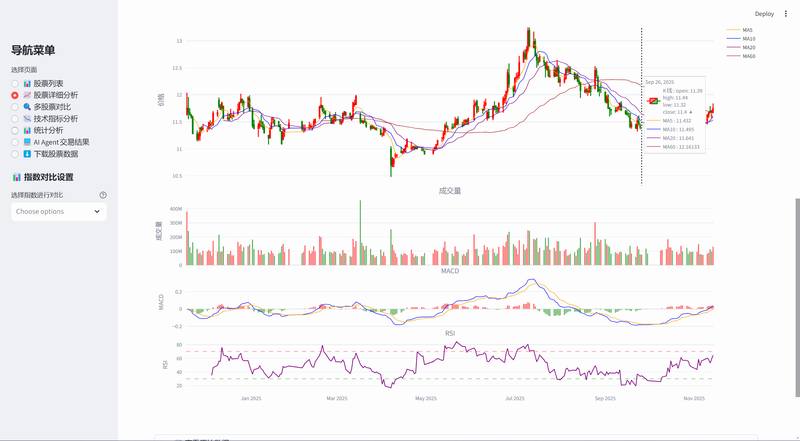
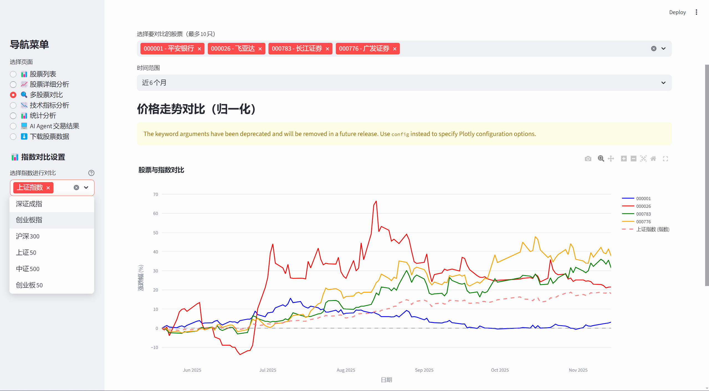
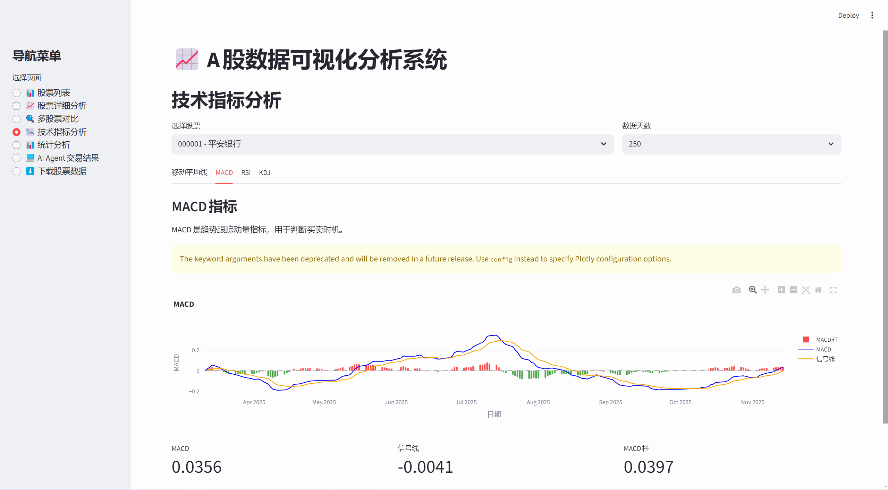
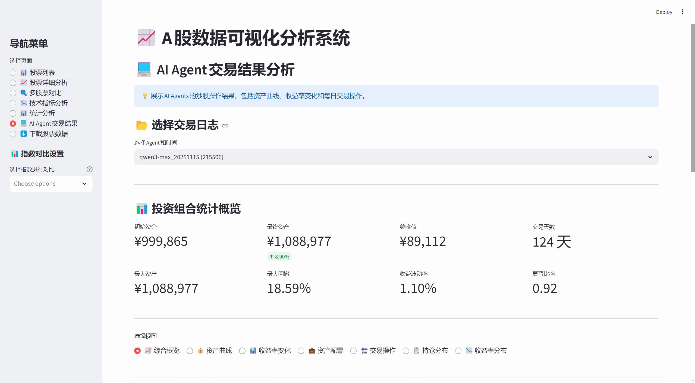
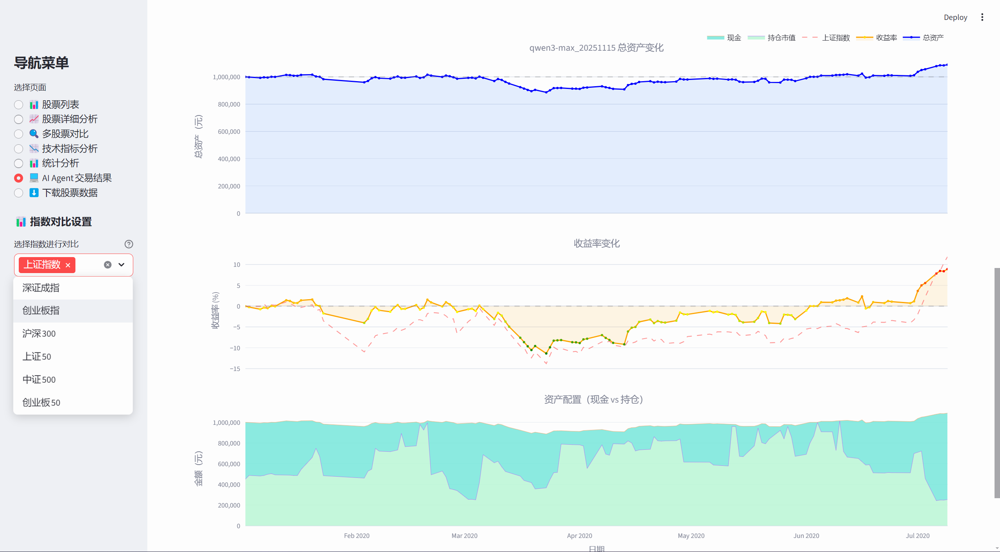
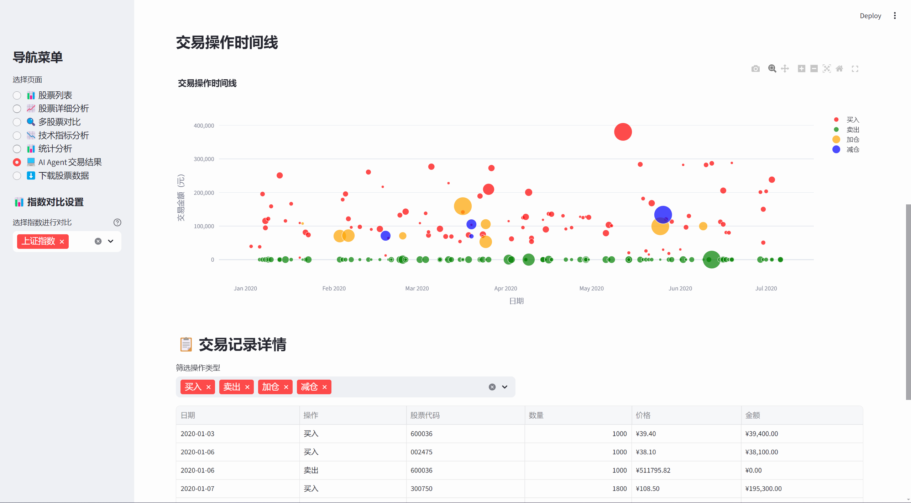

# A股数据可视化与AI智能交易系统

一个功能完善的A股数据分析和AI交易模拟系统，支持历史数据下载、交互式可视化分析、技术指标计算、以及基于大模型的智能交易代理。

## ✨ 主要功能

### 📊 数据可视化系统
- **数据下载**：下载A股股票和主要指数的历史数据（基于akshare）
- **可视化分析**：交互式Web界面，支持K线图、技术指标、多股对比
- **技术指标**：MACD、RSI、KDJ、布林带、移动平均线等11种指标
- **多股对比**：同时对比最多10只股票的走势和收益率
- **统计分析**：价格统计、成交量分析、收益率分布
- **界面下载**：在Web界面中直接下载股票数据，无需命令行

### 💻 AI智能交易系统
- **AI Agent**：基于Qwen3-30B大模型的智能交易代理
- **自主决策**：AI自动分析市场数据，做出买卖决策
- **真实模拟**：完整模拟真实交易环境（T+1、佣金、印花税）
- **性能分析**：详细的收益分析和决策记录
- **防止作弊**：严格防止未来信息泄露，确保公平测试

## 🚀 快速开始

本项目包含两个独立系统，可根据需求选择使用：

### 系统A：数据可视化系统

#### 1. 安装依赖
```bash
pip install -r requirements.txt
```

#### 2. 下载股票数据
```bash
# 下载10只股票数据（测试）
python main.py download-stocks --limit 10

# 下载所有股票数据（不建议）
python main.py download-stocks

# 下载指数数据（可选）
python main.py download-indices
```

#### 3. 启动可视化界面
```bash
python run_visualization.py
```

浏览器会自动打开，或手动访问：http://localhost:8501

#### 4. 开始使用
- **📊 股票列表**：查看所有已下载的股票，支持搜索和分页
- **📈 股票详细分析**：查看K线图、技术指标（组合图、K线、MACD、RSI、KDJ、布林带、收益率）
- **🔍 多股票对比**：对比多只股票的归一化走势和统计数据
- **📉 技术指标分析**：查看MA、MACD、RSI、KDJ的最新数值和建议
- **📊 统计分析**：查看指定周期的价格、成交量、收益率统计
- **⬇️ 下载股票数据**：在界面中直接下载更多股票数据

### 系统B：AI智能交易系统

#### 1. 准备工作
```bash
# 安装主系统依赖
pip install -r requirements.txt

# 进入AI系统目录
cd Agents_Experience

# 安装AI系统依赖
pip install -r requirements.txt
```

#### 2. 配置API密钥
```bash
# 复制环境变量模板
cp .env.example .env

# 编辑.env文件，填入Qwen API密钥
# QWEN_API_KEY=sk-your_actual_api_key_here
```

#### 3. 确保已有股票数据
```bash
# 返回项目根目录
cd ..

# 下载AI系统需要的股票数据（10只优质股票）
python main.py download-stocks --limit 10
```

#### 4. 运行AI交易模拟
```bash
cd Agents_Experience
python run_mvp.py
```

#### 5. 查看结果
- 交易日志：`Agents_Experience/logs/`
- 性能报告：`Agents_Experience/results/`

## 常用命令

### 数据管理
```bash
# 下载股票数据
python main.py download-stocks --limit 50

# 下载指数数据
python main.py download-indices

# 查看已下载股票列表
python main.py list-stocks
```

### 可视化分析
```bash
# 启动Web界面（推荐）
python run_visualization.py

# 直接运行Streamlit
streamlit run visualization/app.py

# 指定端口
streamlit run visualization/app.py --server.port 8502
```

### 模拟交易（可选）
```bash
# 创建账户（默认100万初始资金）
python main.py create-account 我的账户

# 加载账户进行交易
python main.py load-account 我的账户
>>> date 2020-01-02        # 设置模拟日期
>>> buy 000001 1000        # 买入1000股
>>> portfolio              # 查看持仓
>>> sell 000001 500        # 卖出500股
>>> transactions           # 查看交易记录
>>> exit                   # 退出
```

## 📊 可视化功能详解

### 1. 股票列表
- 显示所有已下载股票的代码、名称、数据条数、起始/结束日期
- 支持按股票代码或名称搜索
- 分页显示，每页50条

### 2. 股票详细分析



- **时间范围**：1个月、3个月、6个月、1年、3年、全部、自定义
- **8种图表类型**：
  - 组合图表（K线+成交量+MACD+RSI）
  - K线图（含MA5/10/20/60移动平均线）
  - 成交量图（带成交量均线）
  - MACD图（MACD线、信号线、MACD柱）
  - RSI图（相对强弱指标，超买超卖提示）
  - KDJ图（随机指标）
  - 布林带图（上轨、中轨、下轨）
  - 收益率分析（日收益率、累计收益率）

### 3. 多股票对比



- 同时对比最多10只股票
- 归一化价格走势对比
- 统计数据对比表（总收益率、年化波动率、最高/最低价、平均成交量）

### 4. 技术指标分析



- 显示MA、MACD、RSI、KDJ的最新数值
- 提供参考建议（如超买、超卖、金叉、死叉等）

### 5. 统计分析
- 指定周期统计（30/60/90/180/365天）
- 价格统计（平均价、最高价、最低价、波动幅度）
- 成交量统计（平均成交量、总成交量）
- 收益率统计（平均涨跌幅、最大单日涨跌幅）
- 日收益率分布直方图

## 技术指标说明

### 移动平均线（MA）
- 股价在MA上方为强势，下方为弱势
- 短期MA上穿长期MA为金叉（买入信号）
- 短期MA下穿长期MA为死叉（卖出信号）

### MACD（异同移动平均线）
- MACD线上穿信号线为买入信号
- MACD线下穿信号线为卖出信号
- MACD柱由负转正为看涨，由正转负为看跌

### RSI（相对强弱指数）
- RSI > 70 为超买区域
- RSI < 30 为超卖区域
- RSI在50附近为均衡状态

### KDJ（随机指标）
- K线和D线在20以下为超卖，80以上为超买
- K线上穿D线为买入信号，下穿为卖出信号
- J线可提前K、D线反映趋势变化

### 布林带（Bollinger Bands）
- 价格触及上轨可能回落（超买）
- 价格触及下轨可能反弹（超卖）
- 带宽收窄表示波动率降低，可能酝酿突破

## 💻 AI智能交易系统

### 系统概述

AI智能交易系统使用大模型Agent（Qwen3-30B）自动进行股票交易决策。Agent能够分析历史K线数据、技术指标，并基于市场情况自主做出买入、卖出决策。

### 功能特性

#### Agent能力
- ✅ 查询股票历史K线数据
- ✅ 获取技术指标（MA、MACD、RSI、KDJ等）
- ✅ 查看当前持仓和资金状态
- ✅ 执行买入/卖出操作
- ✅ 严格防止未来信息泄露

#### 模拟引擎
- ✅ 逐日推进时间循环
- ✅ 只提供历史数据，确保公平性
- ✅ 真实交易成本计算（佣金、印花税）
- ✅ 完整交易记录
- ✅ 详细性能统计分析

### MVP配置

- **Agent模型**：Qwen3-30B-A3B (公益API)
- **初始资金**：100万人民币
- **模拟时间**：2020年全年
- **股票池**：可自定义，默认10只优质A股（贵州茅台、招商银行、万科A、中国平安、五粮液、恒瑞医药、宁德时代、比亚迪、伊利股份、立讯精密）
- **交易规则**：T+1交易制度，真实佣金和印花税

### 运行AI交易模拟

#### 1. 配置API密钥
```bash
# 进入AI系统目录
cd Agents_Experience

# 复制环境变量模板
cp .env.example .env

# 编辑.env文件，填入真实的API密钥
# QWEN_API_KEY=sk-your_actual_api_key_here
```

#### 2. 运行MVP测试
```bash
python run_mvp.py
```

或者使用一键启动脚本（Windows）：
```bash
快速开始.bat
```

### AI交易结果展示

以下是AI Agent的实际交易表现：

#### 整体收益概况


#### 详细交易记录


#### 持仓与资金变化


### 输出结果

运行AI交易模拟后，系统会生成以下文件：

1. **交易日志**：`logs/agent_qwen_YYYYMMDD_HHMMSS.log`
   - 完整的Agent思考过程
   - 每次决策的依据
   - 详细的调试信息

2. **性能报告**：`results/performance_report_YYYYMMDD_HHMMSS.json`
   - 总收益率
   - 夏普比率
   - 最大回撤
   - 交易次数统计
   - 每只股票的收益贡献

3. **决策记录**：
   - 每个交易日的市场分析
   - 技术指标解读
   - 买卖决策理由

## 📁 项目结构

```
StockM1/
├── src/stock_app/              # 核心数据模块
│   ├── data_downloader.py      # 数据下载器
│   ├── database.py             # SQLite数据库管理
│   ├── trading_engine.py       # 交易引擎（手动交易）
│   ├── portfolio.py            # 持仓管理
│   └── cli.py                  # 命令行接口
│
├── visualization/              # 可视化Web界面（~1650行代码）
│   ├── app.py                  # Streamlit主应用（6个页面）
│   ├── data_loader.py          # 数据加载模块
│   ├── indicators.py           # 技术指标计算（11个指标）
│   ├── charts.py               # 图表组件（9种图表类型）
│   └── README.md               # 可视化系统文档
│
├── Agents_Experience/          # AI智能交易系统
│   ├── agents/                 # AI Agent实现
│   │   ├── base_agent.py       # Agent基类
│   │   └── qwen_agent.py       # Qwen Agent实现
│   ├── core/                   # 核心模拟引擎
│   │   ├── simulator.py        # 交易模拟引擎
│   │   ├── tools.py            # Agent工具集
│   │   └── data_provider.py   # 数据提供接口
│   ├── prompts/                # 提示词模板
│   │   └── system_prompt.py   # 系统提示词
│   ├── utils/                  # 工具函数
│   │   ├── logger.py           # 日志记录
│   │   └── analyzer.py         # 性能分析
│   ├── results/                # AI交易结果
│   ├── logs/                   # 运行日志
│   ├── config.py               # AI系统配置
│   ├── run_mvp.py              # MVP启动脚本
│   └── README.md               # AI系统文档
│
├── hand_tools/                 # 手动工具脚本
│   └── download_indices.py    # 指数数据下载
│
├── Docs/                       # 项目文档
│   ├── 10年A股数据导入说明.md
│   ├── 性能优化说明.md
│   ├── 指数对比功能说明.md
│   └── 指数数据下载说明.md
│
├── images/                     # 项目截图
│   ├── 股票详细分析页面.png
│   ├── 多股票对比.png
│   ├── 技术指标分析.png
│   ├── AI炒股结果分析1.png
│   ├── AI炒股结果分析2.png
│   └── AI炒股结果分析3.png
│
├── main.py                     # 主程序入口
├── run_visualization.py        # 可视化启动脚本
├── config.py                   # 全局配置
├── requirements.txt            # Python依赖
└── README.md                   # 本文档
```

## ❓ 常见问题

### 数据可视化系统

#### Q: 界面显示"暂无股票数据"
**A:** 需要先下载数据，有两种方式：
```bash
# 方法1：使用命令行
python main.py download-stocks --limit 10

# 方法2：在Web界面中的"下载股票数据"页面直接下载
```

#### Q: 端口8501已被占用
**A:** 使用其他端口：
```bash
streamlit run visualization/app.py --server.port 8502
```

#### Q: 某些技术指标显示不全
**A:** 某些指标需要足够的历史数据才能计算，建议选择较长的时间范围（至少1个月）

### AI智能交易系统

#### Q: 如何获取Qwen API密钥？
**A:** 
1. 访问阿里云通义千问API平台
2. 注册账号并申请API密钥
3. 将密钥填入 `Agents_Experience/.env` 文件

#### Q: AI交易模拟需要多长时间？
**A:** 
- 模拟2020年全年（约250个交易日）
- 每个交易日AI需要思考和决策，大约需要5-10分钟
- 总计约1-2小时完成全部模拟

#### Q: AI的收益率如何？
**A:** 
- 这取决于市场环境和AI的策略
- 2020年是牛市，大部分股票都有不错表现
- AI能否跑赢大盘需要实际测试

#### Q: 可以使用其他AI模型吗？
**A:** 
可以！在 `Agents_Experience/agents/` 目录下创建新的Agent类：
```python
from agents.base_agent import BaseAgent

class YourAgent(BaseAgent):
    # 实现你的AI逻辑
    pass
```

## 🛠️ 技术栈

### 数据可视化系统
- **数据源**：akshare（优质的开源金融数据接口）
- **数据库**：SQLite3（轻量级本地数据库）
- **数据处理**：pandas, numpy
- **Web框架**：Streamlit（快速构建数据应用）
- **图表库**：Plotly（交互式图表）
- **命令行**：Click, Rich（美化命令行）

### AI智能交易系统
- **大模型**：Qwen3-30B-A3B（通义千问）
- **API调用**：OpenAI兼容接口
- **Agent框架**：自研轻量级Agent框架
- **数据接口**：与可视化系统共享数据库
- **日志系统**：Python logging
- **性能分析**：自定义分析工具
## ⚠️ 免责声明

**重要提醒：**

1. 本系统仅供学习和研究使用，不构成任何投资建议
2. 技术指标仅供参考，不保证准确性
3. AI交易模拟结果不代表真实市场表现
4. 历史数据不能预测未来，股市有风险，投资需谨慎
5. 请勿将本系统用于真实交易决策

## 📄 许可证

MIT License

---

**⭐ 如果这个项目对你有帮助，欢迎给个Star！**
